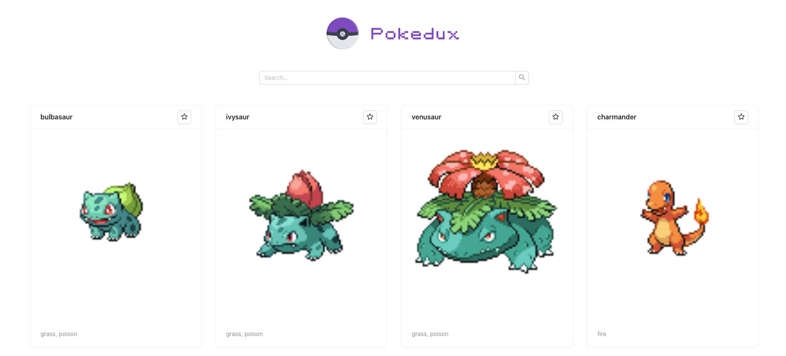

# Pokedux

Pokedux is the pokemon explorer developed to learn how to work with Redux Toolkit.

Currently supported:
  - First generation

## Available Scripts

In the project directory, you can run:

### `npm start`

Runs the app in the development mode.\
Open [http://localhost:3000](http://localhost:3000) to view it in the browser.

The page will reload if you make edits.\
You will also see any lint errors in the console.

## Preview

## Learn More

You can learn more in the [Redux Toolit](https://redux-toolkit.js.org).

You can search more info about pokemons in the [PokeApi](https://pokeapi.co/).

